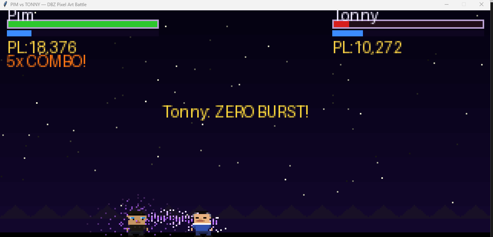
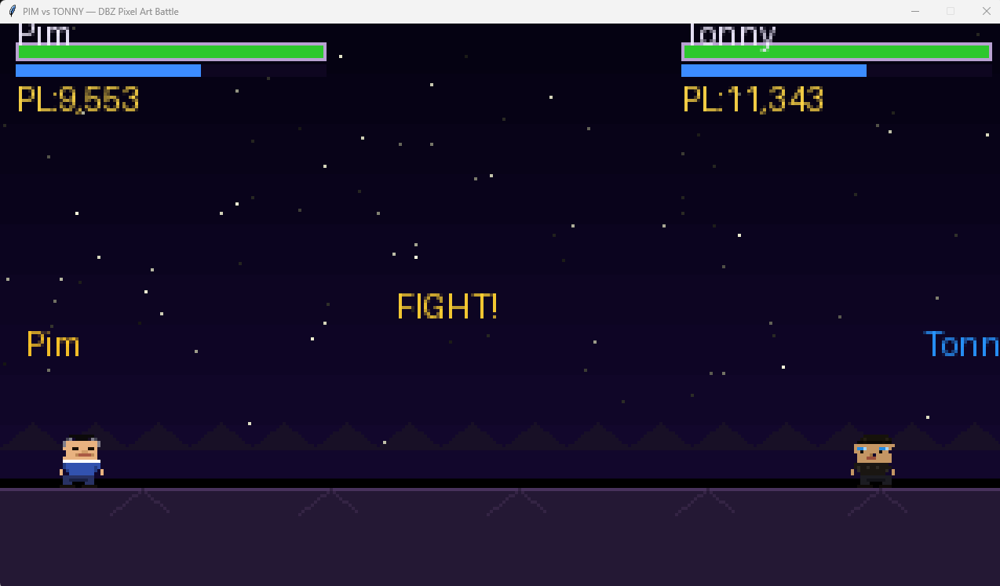

# PIM vs TONNY - DBZ Pixel Art Battle

Animated Dragon Ball Z style type of auto-battle built with Python, Tkinter, and Pillow.  
Two pixel-art fighters (Pim and Tonny) battle in real time with AI-driven move selection, combos, blocks, beam attacks, power-up modes, particles, screen shake, and KO/restart flow.

## What This Project Is

This is a standalone desktop Python game script focused on:

- Retro pixel-art rendering (drawn every frame, not a GIF)
- Fast arcade-style combat simulation
- AI-vs-AI battle logic with varied move choices
- Visual feedback effects (auras, sparks, damage numbers, flashes)

## What It Does

- Opens a Tkinter window and runs a full animated battle loop at 24 FPS.
- Simulates health, energy, combos, knockback, stun states, and KO.
- Uses weighted AI decisions for actions like punch, kick, dash, beam, block, and flight.
- Shows HUD stats: HP, energy, power level, combos, and active mode timers.
- Automatically restarts the match after KO so battles continue endlessly.

## Features

- Custom ASCII-to-pixel sprite system
- Particle engine for aura, impacts, and hit sparks
- Multiple combat states: idle, walk, jump, punch, kick, charge, beam, dash, uppercut, slam, rapid, block, hurt, down, stand, victory
- Reactive blocking and counter outcomes
- Special modes:
  - Burst mode (offensive boost)
  - Shield mode (defensive reduction)
  - Rage mode (high pressure damage/knockback)
- Camera shake and flash effects for major hits
- Intro and KO overlays

## Tech Stack

- Python 3
- Tkinter (GUI)
- Pillow (image rendering)

## Requirements

- Python 3.8+
- Pillow

Install dependency:

```bash
pip install pillow
```

Note: Tkinter is bundled with most Python desktop installs.

## Run

From the project root:

```bash
python battleV2.py
```

## Screenshots

### Match Intro



### Mid-Fight Combat



## Project Structure

```text
PimVsTonny/
  battleV2.py
  LICENSE
  README.md
  requirements.txt
  screenshots/
    battle-intro.png
    battle-combat.png
```

## License

This project is licensed under GNU GPL v3. See LICENSE.
